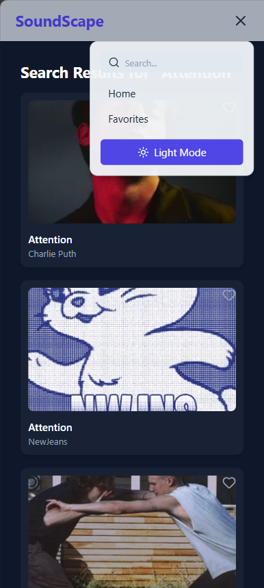
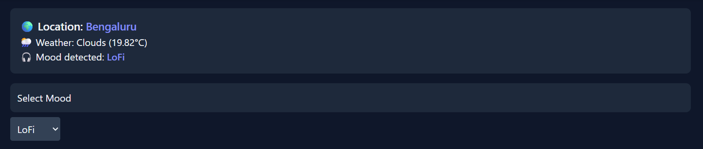

# 🎵 SoundScape  
A full-stack **music mood player** that intelligently recommends and plays songs based on your **mood and weather**, with an elegant and responsive UI.  
Features include mood-based playlists, location-based weather detection, light/dark theme support, global music search, and favorite song management.

---




### Working Demo 
- Watch the working demo at:
https://drive.google.com/drive/folders/18T141rKQSjKAiYPVyCyTG39d_AvR5TOI?usp=drive_link
---

## 🚀 Tech Stack

- **Frontend:** React + TypeScript + TailwindCSS + Framer Motion  
- **Backend:** Node.js + Express + TypeScript  
- **API Services:** iTunes Music API, OpenWeather API  
- **State Management:** Zustand  
- **Deployment:** Vercel (Frontend + Backend)

---

## ✨ Key Features

### 🎧 1. Mood & Weather-Based Music
- Automatically detects your **current location** and **weather**.
- Maps your weather condition to a **matching mood** (e.g., Sunny → Happy, Rainy → Chill).
- Suggests songs from **iTunes API** based on that mood.



---

### 🎶 2. Interactive Music Player
- Full-featured music player with:
  - Play / Pause  
  - Next / Previous track  
  - Seek control (drag to skip)  
  - Volume control & mute toggle  
  - Close player option  


---

### ❤️ 3. Favorites Page
- Save or remove songs from favorites.
- Stored in **localStorage** — persists even after reload.
- Play songs directly from favorites with the same player.


---

### 🌗 4. Light & Dark Theme
- Toggle between **Light** ☀️ and **Dark** 🌙 modes.
- Smooth transition and theme persistence via Zustand.


---

### 🔍 5. Global Search
- Search any song or artist globally via iTunes API.
- Displays search results instantly.
- Allows playback and adding tracks to favorites.


---

### 🔧 Installation Steps

#### 1️⃣ Clone the repository
```bash
git clone https://github.com/Adi-Developer1/SoundScape.git
```
### Start Backend:
- Install dependencies:
```bash
cd SoundScape
cd backend && npm install
cd ../frontend && npm install
```
- Create a .env file in backend/ folder:
PORT=4000
OPENWEATHER_API_KEY=your_openweather_api_key
- Start backend server:
```bash
cd backend
npm run dev
```
### Start Frontend:
```bash
cd ../frontend
npm run dev
```
## Deployment on Vercel
### Backend deployment
- Go to Vercel Dashboard
- Import your GitHub repository
- Select the backend/ directory
- Add environment variable:
  OPENWEATHER_API_KEY = your_api_key
- Build command (if prompted):
  npm install && npm run build
- Start command:
```bash
npm run start
```
- Deployed Successfully
### Frontend deployment
- Import the same repository again in Vercel
- Select the frontend/ directory
- Add environment variable:
VITE_BACKEND_URL = <your_backend_vercel_url>
- Build command:
```bash
npm run build
```
- Output directory:
```bash
dist
```
- Deployed Successfully
